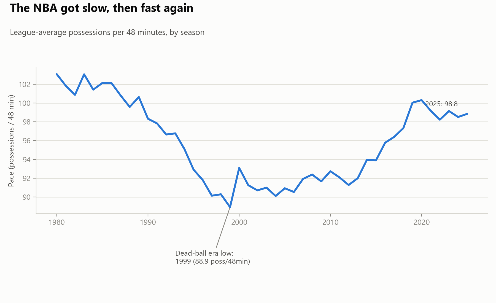
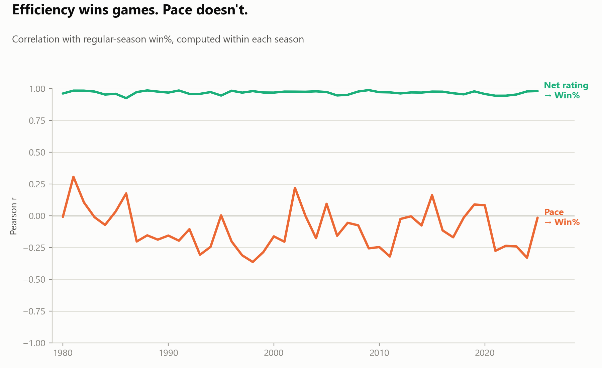
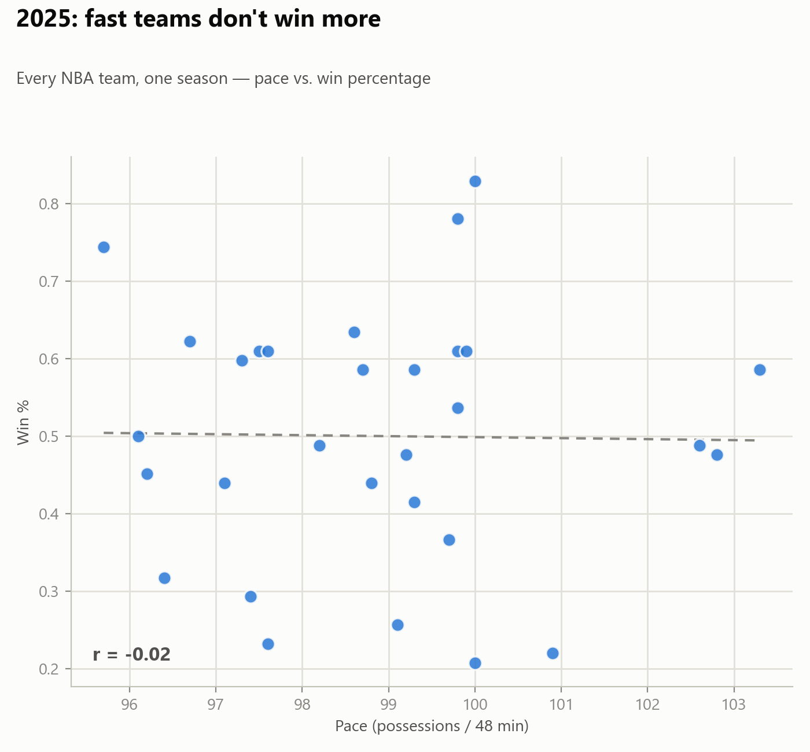

# Does pace win you games in the NBA?

A data project testing one of basketball's most repeated claims — "play faster,
win more" — against 46 seasons of real NBA team data.

## TL;DR

Pace (possessions per 48 minutes) barely predicts anything. Within any given
season, a team's pace has almost no relationship with its win percentage or
even its own offensive rating. What actually predicts winning is net rating
(point differential per 100 possessions) — nearly perfectly, as it should. Speed
is a style choice, not a strategic edge.

## Findings

1. **League pace swings by era, not by strategy.** Average pace fell from 103.1
   possessions/48min in 1980 to a "dead-ball era" low of 88.9 in 1999, then
   climbed back to 98.8 by 2025. Rule changes (illegal defense/hand-checking
   reform in 2004, the 3-point volume shift) track this far better than any
   single team's tactical choice.
2. **Pace doesn't predict winning.** Averaged across all 46 seasons, the
   within-season correlation between a team's pace and its win% is **r = -0.10**
   (std 0.16) — noise, and if anything slightly negative.
3. **Pace doesn't even predict offense.** Correlation between pace and a team's
   own offensive rating: **r = 0.07**. Playing fast is not the same as playing
   well.
4. **Net rating, by contrast, nearly perfectly predicts winning:** r = 0.97.
   This isn't a new insight — offensive rating minus defensive rating is
   mechanically close to point differential, which is well known to track wins —
   but it's the sanity check that makes the pace finding trustworthy: the same
   method finds a near-perfect signal when one exists, and still finds nothing
   for pace.
5. Pooling all 1,284 team-seasons with valid data and removing each season's
   league-average pace (so a leaguewide speed-up doesn't get mistaken for a
   within-season effect): **r = -0.11 (p < 0.001)** — a real but tiny effect,
   in the opposite direction of the popular claim.

## Data & method

- **Source:** Basketball-Reference's per-season "Advanced Stats" team table
  (`Pace`, `ORtg`, `DRtg`, `NRtg`, `W`, `L`, ...), one row per team-season.
- **Coverage:** 1980–2025 (the full 3-point era), 1,330 team-seasons scraped,
  1,284 used in the correlation analysis after dropping rows with missing
  values.
- **Tools:** Python — `requests` + `pandas.read_html` for scraping,
  `scipy.stats` for correlations, `matplotlib` for the charts.
- **Why within-season correlations:** the league's average pace has swung by
  15+ possessions across eras. A naive pooled correlation would confuse "the
  whole league got faster in the 2010s, and also better offensively" with
  "fast teams are better," which is a different claim. Computing Pearson r
  separately within each season (and, for the pooled check, de-meaning by
  season) isolates whether pace matters *relative to that year's peers*.

## Repo structure

```
scripts/
  scrape_nba_advanced_stats.py   # pulls & caches season pages, builds the CSV
  analyze_pace_efficiency.py     # per-season correlations + pooled era-adjusted check
  make_charts.py                 # the three charts below
data/
  raw/                           # cached raw season HTML (so re-runs don't re-hit the site)
  nba_advanced_team_stats.csv    # one row per team-season, 1980-2025
  pace_efficiency_summary.csv    # one row per season: avg pace + correlations
figures/
  01_pace_trend.png
  02_correlation_over_time.png
  03_scatter_latest_season.png
```

## Reproduce it

```bash
pip install pandas requests beautifulsoup4 lxml scipy matplotlib
python scripts/scrape_nba_advanced_stats.py --start 1980 --end 2025
python scripts/analyze_pace_efficiency.py
python scripts/make_charts.py
```

## Charts




